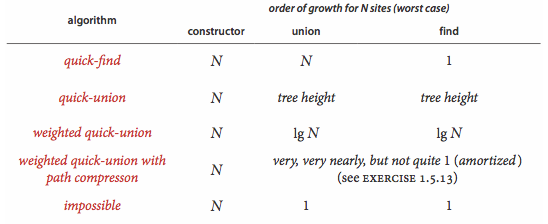

https://www.coursera.org/learn/algorithms-part1/
## 15UnionFind 联合查找（并查集）
### 应用
- 网络中：动态连通性
- 图处理：Kruskal最小生成树算法
- 渗滤模型（_渗透概率p曲线非常陡峭_）->蒙特卡罗仿真
### QuickFind 快速查找
- 构造花费O(n)
- 合并花费O(n) **开销太大**
- 查找花费O(1)
### QuickUnion 快速合并
- 构造花费O(n)
- 合并花费O(n) **包含查找根的花销**
- 查找花费O(n) **开销太大**
### WeightedQuickUnion 加权快速合并
- 构造花费O(n)
- 合并花费O(lg(n)) **包含查找根的花销**
- 查找花费O(lg(n))
### WeightedPathCompressionQuickUnion 具有路径压缩的加权快速合并
- 构造花费O(n)
- ~~**可能有问题？**~~
- 合并花费O(lg(n)) **包含查找根的花销**
- 查找花费O(lg(n))
### 测试数据
- tinyUF.txt
- mediumUF.txt
- largeUF.txt
### 复杂度总结

## 14 Analysis Of Algorithms
- 不同复杂度的图像表现

- 不同复杂度的代码表现

- 不同复杂度的数据范围

- 时间复杂度中三种符号的使用

### ThreeSum 三数求和
- 求解开销O(n³)
### ThreeSumFast 三数快速求和
- 求解开销O(n²lg(n))
### 测试数据
- 1Kints.txt
- 2Kints.txt
- 4ints.txt
- 8Kints.txt
- 16Kints.txt
- 32Kints.txt
- 1Mints.txt
### 补充
- DualPivotQuicksort执行流程

## 13 Stacks And Queues
### Stack
- 使用静态嵌套类的链表构成的栈
### ResizingArrayStack
- 使用可调整大小的数组构成的栈
### 测试数据
- tobe.txt
